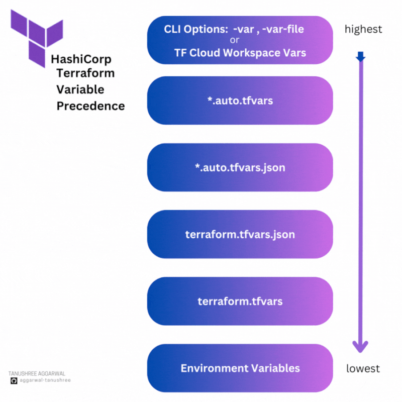

# Terraform Beginner Bootcamp 2023 - Week 1

## Root Module Structure

Our root module structure is as follows:

```
PROJECT_ROOT
│
├── main.tf                 # everything else.
├── variables.tf            # stores the structure of input variables
├── terraform.tfvars        # the data of variables we want to load into our terraform project
├── providers.tf            # defined required providers and their configuration
├── outputs.tf              # stores our outputs
└── README.md               # required for root modules
```

[Standard Module Structure](https://developer.hashicorp.com/terraform/language/modules/develop/structure)

## Terraform and Input Variables

### Terraform Cloud Variables

In terraform we can set two kind of variables:
- Enviroment Variables - those you would set in your bash terminal eg. AWS credentials
- Terraform Variables - those that you would normally set in your tfvars file

We can set Terraform Cloud variables to be sensitive so they are not shown visibliy in the UI.

### Loading Terraform Input Variables

[Terraform Input Variables](https://developer.hashicorp.com/terraform/language/values/variables)

Within the module that declared a variable, its value can be accessed from within [expressions](https://developer.hashicorp.com/terraform/language/expressions) as `var.<NAME>`, where `<NAME>` matches the label given in the declaration block:

> **Note**: Input variables are created by a `variable` block, but you reference them as attributes on an object named `var`.

```hcl
resource "aws_instance" "example" {
  instance_type = "t2.micro"
  ami           = var.image_id
}
```

The value assigned to a variable can only be accessed in expressions within the module where it was declared.

When variables are declared in the root module of your configuration, they can be set in a number of ways:

- In a [Terraform Cloud workspace](https://developer.hashicorp.com/terraform/cloud-docs/workspaces/variables).
- Individually, with the `-var` command line option.
- In variable definitions `(.tfvars)` files, either specified on the command line or automatically loaded.
- As environment variables.

### var flag (Variables on the Command Line)
We can use the `-var` flag to set an input variable or override a variable in the tfvars file eg. `terraform -var user_ud="my-user_id"`

To specify individual variables on the command line, use the `-var` option when running the `terraform plan` and `terraform apply` commands:

```sh
terraform apply -var="image_id=ami-abc123"
terraform apply -var='image_id_list=["ami-abc123","ami-def456"]' -var="instance_type=t2.micro"
terraform apply -var='image_id_map={"us-east-1":"ami-abc123","us-east-2":"ami-def456"}'
```

### var-file flag (Variable Definitions `(.tfvars)` Files)

To set lots of variables, it is more convenient to specify their values in a variable definitions file (with a filename ending in either `.tfvars` or `.tfvars.json`) and then specify that file on the command line with `-var-file`:

```sh
terraform apply -var-file="testing.tfvars"
```

> **Note**: This is how Terraform Cloud passes [workspace variables](https://developer.hashicorp.com/terraform/cloud-docs/workspaces/variables) to Terraform.

### terraform.tvfars

This is the default file to load in terraform variables in blunk

A variable definitions file uses the same basic syntax as Terraform language files, but consists only of variable name assignments:

```hcl
image_id = "ami-abc123"
availability_zone_names = [
  "us-east-1a",
  "us-west-1c",
]
```

Terraform also automatically loads a number of variable definitions files if they are present:

- Files named exactly `terraform.tfvars` or `terraform.tfvars.json`.
- Any files with names ending in `.auto.tfvars` or `.auto.tfvars.json`.

Files whose names end with `.json` are parsed instead as JSON objects, with the root object properties corresponding to variable names:

```json
{
  "image_id": "ami-abc123",
  "availability_zone_names": ["us-west-1a", "us-west-1c"]
}
```

### auto.tfvars

In Terraform, `auto.tfvars` or `auto.tfvars.json` files are used to automatically load variable values without needing to explicitly specify them on the command line or within the main Terraform configuration. These files allow you to set default values for variables, making it easier to manage configurations across different environments and reduce the need for repetitive variable input.

Here's how these files are used:

1. **File Naming Convention**:
   - `auto.tfvars`: For plain text variable values.
   - `auto.tfvars.json`: For JSON-encoded variable values.

2. **Variable Definitions**:
   - In the `auto.tfvars` file, you can define variable values without specifying their names. Terraform will automatically map these values to variables with matching names in your configuration.
   - In the `auto.tfvars.json` file, you define variable values using JSON syntax. Variable names are specified as keys, and their values are provided as corresponding values.

3. **Automatic Loading**:
   - When you run Terraform commands like `terraform apply` or `terraform plan`, Terraform will automatically load values from these files if they are present in the same directory as your Terraform configuration files (e.g., `.tf` files).
   - Terraform will use the values in these files as default values for variables. If a variable already has a value specified in your main configuration or through environment variables, the values from the `auto.tfvars` or `auto.tfvars.json` file will be overridden.

4. **Override Options**:
   - You can still override these default values by specifying variable values explicitly on the command line, in a separate variable file, or through environment variables. Values provided in these ways take precedence over values in the `auto.tfvars` or `auto.tfvars.json` file.

Here's an example of an `auto.tfvars` file:

```hcl
# auto.tfvars
region = "us-west-2"
instance_type = "t2.micro"
```

And here's an example of an `auto.tfvars.json` file:

```json
// auto.tfvars.json
{
  "region": "us-west-2",
  "instance_type": "t2.micro"
}
```

In this example, if you run `terraform apply`, Terraform will automatically use the values specified in the `auto.tfvars` or `auto.tfvars.json` file as defaults for the `region` and `instance_type` variables unless you override them with different values. These files are particularly useful for providing common configurations across multiple environments while allowing easy customization when necessary.

### Environment Variables
As a fallback for the other ways of defining variables, Terraform searches the environment of its own process for environment variables named `TF_VAR_` followed by the name of a declared variable.

This can be useful when running Terraform in automation, or when running a sequence of Terraform commands in succession with the same variables. For example, at a `bash` prompt on a Unix system:

```sh
export TF_VAR_image_id=ami-abc123
terraform plan
```

On operating systems where environment variable names are case-sensitive, Terraform matches the variable name exactly as given in configuration, and so the required environment variable name will usually have a mix of upper and lower case letters as in the above example.

### Order of terraform variables (Variable Definition Precedence)

The above mechanisms for setting variables can be used together in any combination. If the same variable is assigned multiple values, Terraform uses the last value it finds, overriding any previous values. Note that the same variable cannot be assigned multiple values within a single source.

Terraform loads variables in the following order, with later sources taking precedence over earlier ones:

- Environment variables
- The `terraform.tfvars` file, if present.
- The `terraform.tfvars.json` file, if present.
- Any `*.auto.tfvars` or `*.auto.tfvars.json` files, processed in lexical order of their filenames.
- Any `-var` and `-var-file` options on the command line, in the order they are provided. (This includes variables set by a Terraform Cloud workspace.)

Nice visual from [Tanushree - Linkedin Post](https://www.linkedin.com/posts/tanushree-aggarwal_terraformcloudprojectbootcamp-terraform-aws-activity-7111755120912023553-lepQ/?utm_source=share&utm_medium=member_desktop) illustrating the **Terraform input variable precedence**



## Dealing With Configuration Drift

## What happens if we lose our state file?

If you lose your statefile, you most likley have to tear down all your cloud infrastructure manually.

You can use `terraform import` but it won't for all cloud resources. You need check the terraform providers documentation for which resources support import.

### Fix Missing Resources with Terraform Import

`terraform import aws_s3_bucket.bucket bucket-name`

[Terraform Import](https://developer.hashicorp.com/terraform/cli/import)
[AWS S3 Bucket Import](https://registry.terraform.io/providers/hashicorp/aws/latest/docs/resources/s3_bucket#import)

### Fix Manual Configuration

If someone goes and deletes or modifies cloud resource manually through ClickOps. 

If we run Terraform plan with the attempt to put our infrstraucture back into the expected state fixing Configuration Drift