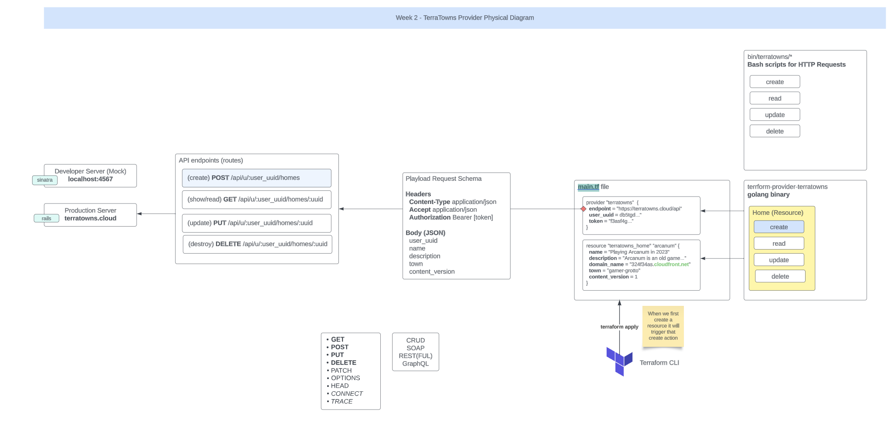
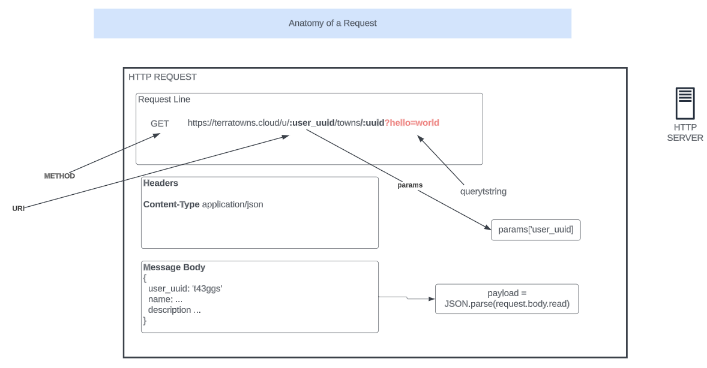

# Terraform Beginner Bootcamp 2023 - Week 2



In week2 we will be building a custom terraform provider with `golang language` which will use to connect our Terra Houses to [Terra Towns](https://terratowns.cloud/) our production server.

The Provider will be used to create a resource for creating, reading, updating, and destroying our terra house in terra towns through the `API endpoints (routes)` as shown in the diagram above.

## Working with Ruby

### Bundler

Bundler is a package manager for runy.
It is the primary way to install ruby packages (known as gems) for ruby.

#### Install Gems

You need to create a Gemfile and define your gems in that file.

```rb
source "https://rubygems.org"

gem 'sinatra'
gem 'rake'
gem 'pry'
gem 'puma'
gem 'activerecord'
```

Then you need to run the `bundle install` command

This will install the gems on the system globally (unlike nodejs which install packages in place in a folder called node_modules)

A Gemfile.lock will be created to lock down the gem versions used in this project.

#### Executing ruby scripts in the context of bundler

We have to use `bundle exec` to tell future ruby scripts to use the gems we installed. This is the way we set context.

### Sinatra

Sinatra is a micro web-framework for ruby to build web-apps.

Its great for mock or development servers or for very simple projects.

You can create a web-server in a single file.

https://sinatrarb.com/

## Terratowns Mock Server
Locally we mocked the Terratowns production server with a mock server using Sinatra.

### Running the web server

We can run the web server by executing the following commands:

```rb
bundle install
bundle exec ruby server.rb
```

Sample Output

```
Use `bundle info [gemname]` to see where a bundled gem is installed.
== Sinatra (v3.1.0) has taken the stage on 4567 for development with backup from Puma
Puma starting in single mode...
* Puma version: 6.3.1 (ruby 3.2.2-p53) ("Mugi No Toki Itaru")
*  Min threads: 0
*  Max threads: 5
*  Environment: development
*          PID: 3594
* Listening on http://127.0.0.1:4567
* Listening on http://[::1]:4567
Use Ctrl-C to stop
```

All of the code for our server is stored in the `server.rb` [file](../terratowns_mock_server/server.rb).

The mock server mocks out the `CRUD` [create, read, update, and delete] operations for our production server.

### Anatomy of a Request


An HTTP (Hypertext Transfer Protocol) request is a message sent by a client (typically a web browser or application) to a web server to request a specific resource, such as a web page, image, or data. The anatomy of an HTTP request consists of several components:

1. Request Method: The HTTP request begins with a method or verb that defines the action the client wants to perform on the resource. Common HTTP methods include:
   - GET: Retrieve data from the server.
   - POST: Send data to the server to create a new resource.
   - PUT: Update an existing resource on the server.
   - DELETE: Remove a resource from the server.
   - HEAD: Retrieve headers of a resource without the actual content.

2. Request URL (Uniform Resource Locator): The URL specifies the address of the resource the client wants to access. It includes the protocol (e.g., http:// or https://), the domain name or IP address of the server, the port number (optional), and the path to the resource.

3. Request Headers: HTTP headers provide additional information about the request or the client making the request. Common headers include:
   - Host: Specifies the domain name or IP address of the server.
   - User-Agent: Identifies the client application or browser making the request.
   - Accept: Informs the server about the types of media it can accept in response (e.g., HTML, JSON, XML).
   - Content-Type: Specifies the media type of the data being sent in the request (for POST and PUT requests).
   - Authorization: Contains credentials or tokens for authentication.
   - Cookies: Contains any cookies associated with the domain.

4. Request Body: In some HTTP methods like POST and PUT, a request may include a body that contains data to be sent to the server. This is commonly used for submitting form data, JSON payloads, or other data.

5. Query Parameters: For GET requests, additional parameters can be included in the URL query string to provide more information to the server. For example, in the URL "https://example.com/search?q=keyword&page=2," "q" and "page" are query parameters.

Here is an example of a simple HTTP GET request:

```plaintext
GET /example.html HTTP/1.1
Host: www.example.com
User-Agent: Mozilla/5.0 (Windows NT 10.0; Win64; x64) AppleWebKit/537.36 (KHTML, like Gecko) Chrome/91.0.4472.124 Safari/537.36
Accept: text/html,application/xhtml+xml,application/xml;q=0.9,image/webp,image/apng,*/*;q=0.8
```

In this example, the client is requesting the resource "/example.html" from the server "www.example.com" using the GET method, and it includes various headers to specify how the response should be handled.

HTTP requests and responses are the building blocks of communication on the World Wide Web, allowing clients and servers to exchange data and content seamlessly.

### Testing Mock server using bash scripts
We can test mock server endpoints using the created bash scripts for creating, reading, updating, and deleting a terra house.

#### Creating a terra house
Run the create bash script to create a terra house

```sh
./bin/terratowns/create
```

Outputs the `uuid` of the created house

```
{"uuid":"a22cf824-fc82-4090-958f-a7835f8bcad9"}
```

#### Getting the details of a terra house
To get the details of a particular terra house, run the read bash script using it's `uuid`

```sh
./bin/terratowns/read a22cf824-fc82-4090-958f-a7835f8bcad9
```

Gives

```json
{
  "uuid": "a22cf824-fc82-4090-958f-a7835f8bcad9",
  "name": "New House",
  "town": "gamers-grotto",
  "description": "A new house description",
  "domain_name": "3xf332sdfs.cloudfront.net",
  "content_version": 1
}
```

#### Updating the details of a terra house
To update the details of a particular terra house, run the update bash script using it's `uuid`

```sh
./bin/terratowns/update a22cf824-fc82-4090-958f-a7835f8bcad9
```

#### Deleting the details of a terra house
To delete a particular terra house, run the delete bash script using it's `uuid`

```sh
./bin/terratowns/delete a22cf824-fc82-4090-958f-a7835f8bcad9
```

## CRUD

Terraform Provider resources utilize CRUD.

CRUD stands for Create, Read Update, and Delete

https://en.wikipedia.org/wiki/Create,_read,_update_and_delete

## Writing Custom Terraform Provider for TerraTowns
- [**Resource: Writing Custom Terraform Providers**](https://www.hashicorp.com/blog/writing-custom-terraform-providers)

Here we write a custom terraform provider we use to connect out terra houses to the [Terra Town Platform](https://terratowns.cloud/). Reference full implementation [here](../terraform-provider-terratowns/main.go)

Locally we test it with our Sinatra Mock Server and later will deploy to the production server

### Explanation of the custom provider code (Using LLM)

```go
func main() {
	plugin.Serve(&plugin.ServeOpts{
		ProviderFunc: Provider,
	})
	fmt.Println("Hello", "World!")
}

type Config struct {
	Endpoint string
	Token string
	UserUuid string
}
```

This code appears to be the beginning of a Go program that is intended to create a custom Terraform provider. Let's break down each portion of the code:

1. `func main() { ... }`:
   - This is the main entry point of the Go program.
   - `plugin.Serve(&plugin.ServeOpts{ ... })` is a call to the `plugin.Serve` function, which is used to start the Terraform provider plugin.
   - `ProviderFunc: Provider` specifies the function that will be called to create an instance of the Terraform provider. In this case, it's referencing a `Provider` function that is expected to be defined elsewhere in the code.
   - `fmt.Println("Hello", "World!")` is a simple print statement that will display "Hello World!" when the program is executed.

2. `type Config struct { ... }`:
   - This defines a custom Go struct named `Config`.
   - `Config` appears to be a configuration structure that may be used to store configuration settings for the Terraform provider.
   - It has three fields: `Endpoint`, `Token`, and `UserUuid`, which are all of type `string`. These fields are meant to hold values related to the provider's configuration.

Please note that the code provided is just the beginning, and it references a `Provider` function that should be defined elsewhere in the code to implement the actual functionality of the Terraform provider. Additional code is required to complete the provider implementation, register resources, and handle Terraform resource operations.

#### Provider function
```go
func Provider() *schema.Provider {
	var p *schema.Provider
	p = &schema.Provider{
		ResourcesMap:  map[string]*schema.Resource{
			"terratowns_home": Resource(),
		},
		DataSourcesMap:  map[string]*schema.Resource{

		},
		Schema: map[string]*schema.Schema{
			"endpoint": {
				Type: schema.TypeString,
				Required: true,
				Description: "The endpoint for hte external service",
			},
			"token": {
				Type: schema.TypeString,
				Sensitive: true, // make the token as sensitive to hide it the logs
				Required: true,
				Description: "Bearer token for authorization",
			},
			"user_uuid": {
				Type: schema.TypeString,
				Required: true,
				Description: "UUID for configuration",
				ValidateFunc: validateUUID,
			},
		},
	}
	p.ConfigureContextFunc = providerConfigure(p)
	return p
}
```

The code you provided defines the `Provider` function, which is used to create and configure a custom Terraform provider. Let's break down the code:

1. `func Provider() *schema.Provider { ... }`:
   - This is a function named `Provider` that returns a pointer to a `schema.Provider`. In Terraform custom provider development, this function is used to define and configure the provider.

2. `var p *schema.Provider`:
   - This declares a variable `p` of type `*schema.Provider`. `p` will be used to hold the configuration for the provider.

3. `p = &schema.Provider{ ... }`:
   - Here, a `schema.Provider` is created and assigned to the `p` variable.
   - `ResourcesMap` is a map that associates resource types with their respective resource configurations. In this code, it associates a resource type named "terratowns_home" with the configuration defined by the `Resource()` function. This means that when Terraform encounters a resource block with the type "terratowns_home" in a configuration file, it will use the `Resource()` function to manage that resource.
   
4. `DataSourcesMap`:
   - This map can be used to associate data source types with their configurations. In this code, it's left empty, indicating that there are no data sources defined.

5. `Schema`:
   - This map defines the configuration schema for the provider. It lists the configuration variables that can be set when configuring the provider.
   - The schema includes three configuration variables: "endpoint," "token," and "user_uuid."
     - Each configuration variable has a `Type` specified, indicating that they are all of type `schema.TypeString`, which means they are expected to be strings.
     - `Required: true` indicates that all three configuration variables are required and must be provided.
     - `Description` provides a description for each configuration variable, explaining its purpose.
     - `Sensitive: true` is used for the "token" configuration variable, which means that the value of "token" is sensitive, and Terraform should hide it in logs.

6. `p.ConfigureContextFunc = providerConfigure(p)`:
   - This line sets the `ConfigureContextFunc` of the `p` provider. It assigns the function `providerConfigure(p)` to handle the provider configuration. This function is likely implemented elsewhere in the codebase and is responsible for setting up the provider with the values provided in the configuration.

This code sets up the basic structure and configuration for the Terraform provider, including defining its schema and resource handling. Additional code and functions are typically required to implement the actual provider logic for managing resources and handling CRUD operations.

#### Validating UUID

```go
func validateUUID(v interface{}, k string) (ws []string, errors []error) {
	log.Print("validateUUID:start")
	value := v.(string)
	if _, err := uuid.Parse(value); err != nil {
		errors = append(errors, fmt.Errorf("invalid UUID format"))
	}
	log.Print("validateUUID:end")
	return
}
```

The code you provided defines a Go function named `validateUUID`. This function is used for validating a string as a UUID (Universally Unique Identifier). Let's break down the code:

1. `func validateUUID(v interface{}, k string) (ws []string, errors []error) { ... }`:
   - This is a function definition for `validateUUID`.
   - It takes two parameters:
     - `v interface{}`: This is an interface type, which means it can accept values of various types.
     - `k string`: This is a string parameter, which is not used in the function.

2. `log.Print("validateUUID:start")`:
   - This line logs a message indicating the start of the `validateUUID` function. It's a log message that helps track the execution of the function.

3. `value := v.(string)`:
   - This line attempts to assert the value of the `v` parameter as a string and assigns it to the `value` variable.
   - It assumes that the `v` parameter contains a string value. If `v` is not a string, this line will panic with a runtime error.

4. `if _, err := uuid.Parse(value); err != nil { ... }`:
   - This code attempts to parse the `value` as a UUID using the `uuid.Parse` function.
   - If the parsing fails and an error is returned (i.e., `err` is not `nil`), it means that the `value` is not a valid UUID.
   - In this case, an error message is added to the `errors` slice using `fmt.Errorf`, indicating that the format of the UUID is invalid.

5. `log.Print("validateUUID:end")`:
   - This line logs a message indicating the end of the `validateUUID` function.

6. `return`:
   - This function returns two values: `ws` (a slice of strings) and `errors` (a slice of errors).
   - `ws` is not used in this function and is returned as an empty slice.
   - `errors` contains any error messages generated during validation. If the UUID validation fails, an error message will be added to this slice.

The purpose of this function is to validate whether a string represents a valid UUID. If the provided string is not a valid UUID, it records an error message. This function is likely used as part of the validation process for the "user_uuid" configuration variable in the Terraform provider's schema, which was defined in the previous code snippet you provided.

#### Resource Schema

```go
func Resource() *schema.Resource {
	log.Print("Resource:start")
	resource := &schema.Resource{
		CreateContext: resourceHouseCreate,
		ReadContext: resourceHouseRead,
		UpdateContext: resourceHouseUpdate,
		DeleteContext: resourceHouseDelete,
		Schema: map[string]*schema.Schema{
			"name": {
				Type: schema.TypeString,
				Required: true,
				Description: "Name of home",
			},
			"description": {
				Type: schema.TypeString,
				Required: true,
				Description: "Description of home",
			},
			"domain_name": {
				Type: schema.TypeString,
				Required: true,
				Description: "Domain name of home eg. *.cloudfront.net",
			},
			"town": {
				Type: schema.TypeString,
				Required: true,
				Description: "The town to which the home will belong to",
			},
			"content_version": {
				Type: schema.TypeInt,
				Required: true,
				Description: "The content version of the home",
			},
		},
	}
	log.Print("Resource:start")
	return resource
}
```

The code you provided defines a Go function named `Resource()`, which is used to create and configure a Terraform resource. Let's break down the code:

1. `func Resource() *schema.Resource { ... }`:
   - This is a function definition for `Resource`, which returns a pointer to a `schema.Resource`. In Terraform provider development, this function is used to define the configuration for a resource type.

2. `log.Print("Resource:start")`:
   - This line logs a message indicating the start of the `Resource` function. It's a log message that helps track the execution of the function.

3. `resource := &schema.Resource{ ... }`:
   - Here, a `schema.Resource` configuration is created and assigned to the `resource` variable.
   - This configuration defines how Terraform should manage the resource, including its create, read, update, and delete operations.

4. `CreateContext`, `ReadContext`, `UpdateContext`, and `DeleteContext`:
   - These fields specify the functions that Terraform should call when performing the respective operations on the resource.
   - For example, `CreateContext` specifies the function `resourceHouseCreate` to be called when a new resource instance is created.
   - Similarly, `ReadContext`, `UpdateContext`, and `DeleteContext` specify functions for reading, updating, and deleting the resource, respectively.

5. `Schema`:
   - This map defines the schema for the resource. It specifies the configuration variables that can be set when defining an instance of this resource in a Terraform configuration.
   - The schema includes five configuration variables: "name," "description," "domain_name," "town," and "content_version."
     - Each configuration variable has a `Type` specified, indicating their data type.
     - `Required: true` indicates that all five configuration variables are required and must be provided when defining the resource.
     - `Description` provides a description for each configuration variable, explaining its purpose.

6. `log.Print("Resource:start")`:
   - This line logs a message indicating the end of the `Resource` function.

This function sets up the basic structure and configuration for a Terraform resource type named "terratowns_home," including its schema and CRUD operation handling functions. Additional code is typically required to implement the actual resource operations, such as creating, reading, updating, and deleting resources in the external system.

#### Creating a resource

```go
func resourceHouseCreate(ctx context.Context, d *schema.ResourceData, m interface{}) diag.Diagnostics {
	log.Print("resourceHouseCreate:start")
	var diags diag.Diagnostics

	config := m.(*Config)

	payload := map[string]interface{}{
		"name": d.Get("name").(string),
		"description": d.Get("description").(string),
		"domain_name": d.Get("domain_name").(string),
		"town": d.Get("town").(string),
		"content_version": d.Get("content_version").(int),
	}
	payloadBytes, err := json.Marshal(payload)
	if err != nil {
		return diag.FromErr(err)
	}

	url :=  config.Endpoint+"/u/"+config.UserUuid+"/homes"
	log.Print("URL: "+ url)
	// Construct the HTTP Request
	req, err := http.NewRequest("POST", url, bytes.NewBuffer(payloadBytes))
	if err != nil {
		return diag.FromErr(err)
	}

	// Set Headers
	req.Header.Set("Authorization", "Bearer "+config.Token)
	req.Header.Set("Content-Type", "application/json")
	req.Header.Set("Accept", "application/json")

	client := http.Client{}
	resp, err := client.Do(req)
	if err != nil {
		return diag.FromErr(err)
	}
	defer resp.Body.Close()

	// parse response JSON
	var responseData map[string]interface{}
	if err := json.NewDecoder(resp.Body).Decode(&responseData);  err != nil {
		return diag.FromErr(err)
	}

	// StatusOK = 200 HTTP Response Code
	if resp.StatusCode != http.StatusOK {
		return diag.FromErr(fmt.Errorf("failed to create home resource, status_code: %d, status: %s, body %s", resp.StatusCode, resp.Status, responseData))
	}

	// handle response status

	homeUUID := responseData["uuid"].(string)
	d.SetId(homeUUID)

	log.Print("resourceHouseCreate:end")

	return diags
}
```

The code you provided is a Go function named `resourceHouseCreate`, which is responsible for handling the creation of a Terraform resource of type "terratowns_home." Let's break down the code:

1. `func resourceHouseCreate(ctx context.Context, d *schema.ResourceData, m interface{}) diag.Diagnostics { ... }`:
   - This is the function signature for handling the creation of the resource.
   - It takes three parameters:
     - `ctx context.Context`: A context used for managing timeouts and cancellations (not used in this function).
     - `d *schema.ResourceData`: A pointer to `schema.ResourceData`, which represents the current state of the resource being created or managed.
     - `m interface{}`: An interface that represents the provider configuration (`*Config`).

2. `log.Print("resourceHouseCreate:start")`:
   - This line logs a message indicating the start of the `resourceHouseCreate` function.

3. `var diags diag.Diagnostics`:
   - `diags` is a variable of type `diag.Diagnostics`. It's used to collect any diagnostic information or errors that may occur during the resource creation process.

4. `config := m.(*Config)`:
   - This line asserts the `m` interface as a `*Config` pointer. It assumes that the `m` parameter contains the provider configuration (`*Config`).

5. `payload`:
   - This map `payload` is constructed using values from the `schema.ResourceData` (configuration values for the resource).
   - It collects the values of "name," "description," "domain_name," "town," and "content_version" from the `d` parameter (resource data).

6. `payloadBytes, err := json.Marshal(payload)`:
   - This line serializes the `payload` map into a JSON-encoded byte array. This JSON payload will be sent in the HTTP request body when creating the resource.

7. `url`:
   - The URL for the HTTP POST request is constructed using values from the provider's configuration and the resource data.

8. `req, err := http.NewRequest("POST", url, bytes.NewBuffer(payloadBytes))`:
   - This code constructs an HTTP POST request with the JSON payload. It sets the request method, URL, and body.

9. Setting HTTP request headers:
   - Several headers are set on the request, including "Authorization" (for the bearer token), "Content-Type," and "Accept" headers.

10. Sending the HTTP request:
   - The HTTP request is sent using an HTTP client, and the response is stored in the `resp` variable.

11. Parsing the response:
   - The response body is parsed as JSON into the `responseData` map.

12. Checking the HTTP response status:
   - If the HTTP response status code is not 200 (OK), an error is returned with details about the failure, including the status code, status text, and response body.

13. Setting the resource ID:
   - If the creation is successful, the resource ID is set to the UUID received in the response, allowing Terraform to track this resource.

14. `log.Print("resourceHouseCreate:end")`:
   - This line logs a message indicating the end of the `resourceHouseCreate` function.

15. The function returns `diags`, which can contain any diagnostic information or errors encountered during the resource creation process.

This function is responsible for creating a resource in an external system by making an HTTP POST request with the specified data. If successful, it updates the Terraform state with the resource's ID for future management. If there are any errors during this process, they are collected in the `diags` variable.

#### Reading a resource

```go
func resourceHouseRead(ctx context.Context, d *schema.ResourceData, m interface{}) diag.Diagnostics {
	log.Print("resourceHouseRead:start")
	var diags diag.Diagnostics

	config := m.(*Config)

	homeUUID := d.Id()

	// Construct the HTTP Request
	url := config.Endpoint+"/u/"+config.UserUuid+"/homes/"+homeUUID
	log.Print("URL: "+ url)
	req, err := http.NewRequest("GET", url, nil)
	if err != nil {
		return diag.FromErr(err)
	}

	// Set Headers
	req.Header.Set("Authorization", "Bearer "+config.Token)
	req.Header.Set("Content-Type", "application/json")
	req.Header.Set("Accept", "application/json")

	client := http.Client{}
	resp, err := client.Do(req)
	if err != nil {
		return diag.FromErr(err)
	}
	defer resp.Body.Close()

	var responseData map[string]interface{}

	if resp.StatusCode == http.StatusOK {
		// parse response JSON
		if err := json.NewDecoder(resp.Body).Decode(&responseData);  err != nil {
			return diag.FromErr(err)
		}
		d.Set("name",responseData["name"].(string))
		d.Set("description",responseData["description"].(string))
		d.Set("domain_name",responseData["domain_name"].(string))
		d.Set("content_version",responseData["content_version"].(float64))
	} else if resp.StatusCode != http.StatusNotFound {
		d.SetId("")
	} else if resp.StatusCode != http.StatusOK {
		return diag.FromErr(fmt.Errorf("failed to read home resource, status_code: %d, status: %s, body %s", resp.StatusCode, resp.Status, responseData))
	}

	log.Print("resourceHouseRead:end")

	return diags
}
```

The code you provided is a Go function named `resourceHouseRead`, which is responsible for reading the state of a Terraform resource of type "terratowns_home." Let's break down the code:

1. `func resourceHouseRead(ctx context.Context, d *schema.ResourceData, m interface{}) diag.Diagnostics { ... }`:
   - This is the function signature for handling the reading of the resource's state.
   - It takes three parameters:
     - `ctx context.Context`: A context used for managing timeouts and cancellations (not used in this function).
     - `d *schema.ResourceData`: A pointer to `schema.ResourceData`, which represents the current state of the resource being read.
     - `m interface{}`: An interface that represents the provider configuration (`*Config`).

2. `log.Print("resourceHouseRead:start")`:
   - This line logs a message indicating the start of the `resourceHouseRead` function.

3. `var diags diag.Diagnostics`:
   - `diags` is a variable of type `diag.Diagnostics`. It's used to collect any diagnostic information or errors that may occur during the resource reading process.

4. `config := m.(*Config)`:
   - This line asserts the `m` interface as a `*Config` pointer, assuming that `m` contains the provider configuration (`*Config`).

5. `homeUUID := d.Id()`:
   - The resource's UUID (ID) is retrieved from the `schema.ResourceData` and stored in the `homeUUID` variable. This ID is used to construct the URL for fetching the resource's details.

6. Constructing the HTTP request:
   - The URL for the HTTP GET request is constructed using values from the provider's configuration, the resource ID (`homeUUID`), and the resource type ("homes").
   - An HTTP GET request is created with the constructed URL.

7. Setting HTTP request headers:
   - Similar to the creation function, several headers are set on the request, including "Authorization," "Content-Type," and "Accept" headers.

8. Sending the HTTP request:
   - The HTTP request is sent using an HTTP client, and the response is stored in the `resp` variable.

9. Parsing the response:
   - If the HTTP response status code is 200 (OK), the response body is parsed as JSON into the `responseData` map.
   - The values from `responseData` are then set in the resource data using `d.Set()` to update the Terraform state.

10. Handling HTTP response status codes:
    - If the status code is not 200 (OK) but also not 404 (Not Found), the resource's ID is set to an empty string, effectively marking the resource as deleted.
    - If the status code is not 200 (OK) and not 404 (Not Found), an error is returned with details about the failure, including the status code, status text, and response body.

11. `log.Print("resourceHouseRead:end")`:
    - This line logs a message indicating the end of the `resourceHouseRead` function.

12. The function returns `diags`, which can contain any diagnostic information or errors encountered during the resource reading process.

This function is responsible for reading the state of a resource in an external system by making an HTTP GET request and updating the Terraform state accordingly. If the resource exists, its details are fetched and used to update the resource's attributes in Terraform. If the resource is not found, it is marked as deleted in Terraform. Any errors encountered during this process are collected in the `diags` variable.

#### Updating a resource

```go
func resourceHouseUpdate(ctx context.Context, d *schema.ResourceData, m interface{}) diag.Diagnostics {
	log.Print("resourceHouseUpdate:start")
	var diags diag.Diagnostics

	config := m.(*Config)

	homeUUID := d.Id()

	payload := map[string]interface{}{
		"name": d.Get("name").(string),
		"description": d.Get("description").(string),
		"content_version": d.Get("content_version").(int),
	}
	payloadBytes, err := json.Marshal(payload)
	if err != nil {
		return diag.FromErr(err)
	}

	// Construct the HTTP Request
	url := config.Endpoint+"/u/"+config.UserUuid+"/homes/"+homeUUID
	log.Print("URL: "+ url)
	req, err := http.NewRequest("PUT", url, bytes.NewBuffer(payloadBytes))
	if err != nil {
		return diag.FromErr(err)
	}

	// Set Headers
	req.Header.Set("Authorization", "Bearer "+config.Token)
	req.Header.Set("Content-Type", "application/json")
	req.Header.Set("Accept", "application/json")

	client := http.Client{}
	resp, err := client.Do(req)
	if err != nil {
		return diag.FromErr(err)
	}
	defer resp.Body.Close()

	// StatusOK = 200 HTTP Response Code
	if resp.StatusCode != http.StatusOK {
		return diag.FromErr(fmt.Errorf("failed to update home resource, status_code: %d, status: %s", resp.StatusCode, resp.Status))
	}

	log.Print("resourceHouseUpdate:end")

	d.Set("name",payload["name"])
	d.Set("description",payload["description"])
	d.Set("content_version",payload["content_version"])
	return diags
}
```

The code you provided is a Go function named `resourceHouseUpdate`, which is responsible for updating the state of a Terraform resource of type "terratowns_home." Let's break down the code:

1. `func resourceHouseUpdate(ctx context.Context, d *schema.ResourceData, m interface{}) diag.Diagnostics { ... }`:
   - This is the function signature for handling the update of the resource's state.
   - It takes three parameters:
     - `ctx context.Context`: A context used for managing timeouts and cancellations (not used in this function).
     - `d *schema.ResourceData`: A pointer to `schema.ResourceData`, which represents the current state of the resource being updated.
     - `m interface{}`: An interface that represents the provider configuration (`*Config`).

2. `log.Print("resourceHouseUpdate:start")`:
   - This line logs a message indicating the start of the `resourceHouseUpdate` function.

3. `var diags diag.Diagnostics`:
   - `diags` is a variable of type `diag.Diagnostics`. It's used to collect any diagnostic information or errors that may occur during the resource update process.

4. `config := m.(*Config)`:
   - This line asserts the `m` interface as a `*Config` pointer, assuming that `m` contains the provider configuration (`*Config`).

5. `homeUUID := d.Id()`:
   - The resource's UUID (ID) is retrieved from the `schema.ResourceData` and stored in the `homeUUID` variable. This ID is used to construct the URL for updating the resource.

6. Constructing the HTTP request:
   - The URL for the HTTP PUT request is constructed using values from the provider's configuration, the resource ID (`homeUUID`), and the resource type ("homes").
   - An HTTP PUT request is created with the constructed URL.

7. Setting HTTP request headers:
   - Similar to the creation and reading functions, several headers are set on the request, including "Authorization," "Content-Type," and "Accept" headers.

8. Sending the HTTP request:
   - The HTTP request is sent using an HTTP client, and the response is stored in the `resp` variable.

9. Checking the HTTP response status:
   - If the status code is not 200 (OK), an error is returned with details about the failure, including the status code and status text.

10. Updating the resource data:
    - If the update is successful, the resource's attributes in Terraform are updated with the values from the `payload` map.

11. `log.Print("resourceHouseUpdate:end")`:
    - This line logs a message indicating the end of the `resourceHouseUpdate` function.

12. The function returns `diags`, which can contain any diagnostic information or errors encountered during the resource update process.

This function is responsible for updating the state of a resource in an external system by making an HTTP PUT request with the specified data. If the update is successful, it updates the Terraform state with the new attribute values. Any errors encountered during this process are collected in the `diags` variable.

#### Delete a resource

```go
func resourceHouseDelete(ctx context.Context, d *schema.ResourceData, m interface{}) diag.Diagnostics {
	log.Print("resourceHouseDelete:start")
	var diags diag.Diagnostics

	config := m.(*Config)

	homeUUID := d.Id()

	// Construct the HTTP Request
	url :=  config.Endpoint+"/u/"+config.UserUuid+"/homes/"+homeUUID
	log.Print("URL: "+ url)
	req, err := http.NewRequest("DELETE", url , nil)
	if err != nil {
		return diag.FromErr(err)
	}

	// Set Headers
	req.Header.Set("Authorization", "Bearer "+config.Token)
	req.Header.Set("Content-Type", "application/json")
	req.Header.Set("Accept", "application/json")

	client := http.Client{}
	resp, err := client.Do(req)
	if err != nil {
		return diag.FromErr(err)
	}
	defer resp.Body.Close()

	// StatusOK = 200 HTTP Response Code
	if resp.StatusCode != http.StatusOK {
		return diag.FromErr(fmt.Errorf("failed to delete home resource, status_code: %d, status: %s", resp.StatusCode, resp.Status))
	}

	d.SetId("")

	log.Print("resourceHouseDelete:end")
	return diags
}
```

The code you provided is a Go function named `resourceHouseDelete`, which is responsible for deleting a Terraform resource of type "terratowns_home." Let's break down the code:

1. `func resourceHouseDelete(ctx context.Context, d *schema.ResourceData, m interface{}) diag.Diagnostics { ... }`:
   - This is the function signature for handling the deletion of the resource.
   - It takes three parameters:
     - `ctx context.Context`: A context used for managing timeouts and cancellations (not used in this function).
     - `d *schema.ResourceData`: A pointer to `schema.ResourceData`, which represents the current state of the resource being deleted.
     - `m interface{}`: An interface that represents the provider configuration (`*Config`).

2. `log.Print("resourceHouseDelete:start")`:
   - This line logs a message indicating the start of the `resourceHouseDelete` function.

3. `var diags diag.Diagnostics`:
   - `diags` is a variable of type `diag.Diagnostics`. It's used to collect any diagnostic information or errors that may occur during the resource deletion process.

4. `config := m.(*Config)`:
   - This line asserts the `m` interface as a `*Config` pointer, assuming that `m` contains the provider configuration (`*Config`).

5. `homeUUID := d.Id()`:
   - The resource's UUID (ID) is retrieved from the `schema.ResourceData` and stored in the `homeUUID` variable. This ID is used to construct the URL for deleting the resource.

6. Constructing the HTTP request:
   - The URL for the HTTP DELETE request is constructed using values from the provider's configuration, the resource ID (`homeUUID`), and the resource type ("homes").
   - An HTTP DELETE request is created with the constructed URL.

7. Setting HTTP request headers:
   - Similar to the other functions, several headers are set on the request, including "Authorization," "Content-Type," and "Accept" headers.

8. Sending the HTTP request:
   - The HTTP request is sent using an HTTP client, and the response is stored in the `resp` variable.

9. Checking the HTTP response status:
   - If the status code is not 200 (OK), an error is returned with details about the failure, including the status code and status text.

10. Clearing the resource ID:
    - If the deletion is successful, the resource's ID in Terraform is cleared (set to an empty string), indicating that the resource no longer exists.

11. `log.Print("resourceHouseDelete:end")`:
    - This line logs a message indicating the end of the `resourceHouseDelete` function.

12. The function returns `diags`, which can contain any diagnostic information or errors encountered during the resource deletion process.

This function is responsible for deleting a resource in an external system by making an HTTP DELETE request. If the deletion is successful, it clears the resource's ID in Terraform to indicate that the resource no longer exists. Any errors encountered during this process are collected in the `diags` variable.

Now in our `main.tf` file we can access the custom provider with the settings as below

```tf
terraform {
  required_providers {
    terratowns = {
      source  = "local.providers/local/terratowns"
      version = "1.0.0"
    }
  }
}

provider "terratowns" {
  endpoint  = "http://localhost:4567/api"
  user_uuid = "e328f4ab-b99f-421c-84c9-4ccea042c7d1"
  token     = "9b49b3fb-b8e9-483c-b703-97ba88eef8e0"
}

resource "terratowns_home" "home" {
  name        = "How to play Need for Speed Games"
  description = <<DESCRIPTION
Welcome to the ultimate destination for Need for Speed enthusiasts! 
This is dedicated to celebrating and discussing the adrenaline-pumping 
racing games of the Need for Speed franchise, with a special focus on 
iconic titles like "Most Wanted," "Hot Pursuit," and "Rivals." 
Whether you're a seasoned street racer or just getting started, here you'll 
find insights, tips, and strategies on how to rise to the top and take on your rivals.
DESCRIPTION
  #domain_name = module.terrahouse_aws.cloudfront_url
  domain_name     = "3fdq3gz.cloudfront.net"
  town            = "gamers-grotto"
  content_version = 1
}
```

To build and install our custom provider locally we run the bash script [build_provider](../bin/build_provider)

```sh
./bin/build_provider
```

Running `terraform apply` will create our `terratowns_home` resource
