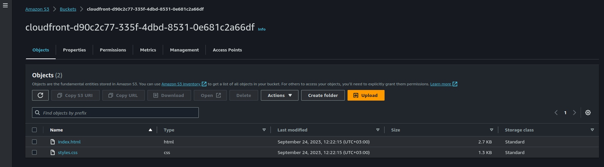

# Host Static website on AWS S3 through Cloudfront distribution (ClickOps - AWS web console)

Here are the steps to upload a static website to an AWS S3 bucket and enable it through AWS CloudFront:

**Step 1: Create an S3 Bucket**

1. Log in to your AWS Management Console.

2. Navigate to the AWS S3 service.

3. Click the "Create bucket" button.

4. Choose a globally unique bucket name and select a region for your bucket.

5. Leave all other settings as default and click through the steps to create the bucket.


**Step 2: Enable Static Website Hosting**

6. Once the bucket is created, click on its name to access its properties.

7. Go to the "Properties" tab and scroll down to the "Static website hosting" card.

8. Click the "Edit" button.

9. Select the "Use this bucket to host a website" option.

10. In the "Index document" field, enter `index.html` or the name of your main HTML file.

11. Click "Save changes."


**Step 3: Upload Your Website Files**

12. Use the AWS Command Line Interface (CLI) to upload your website files (e.g., `index.html` and `styles.css`) to the S3 bucket. Replace `<local-file-path>` and `<s3-bucket-name>` with your actual file path and bucket name:

#### References
- [aws S3 CLI](https://awscli.amazonaws.com/v2/documentation/api/latest/reference/s3/index.html#available-commands)
- [s3 cp cli - examples](https://awscli.amazonaws.com/v2/documentation/api/latest/reference/s3/cp.html#examples)

```bash
aws s3 cp <local-file-path>/index.html s3://<s3-bucket-name>/
aws s3 cp <local-file-path>/styles.css s3://<s3-bucket-name>/
```

```sh
export BUCKET=cloudfront-d90c2c77-335f-4dbd-8531-0e681c2a66df
aws s3 cp ./public s3://${BUCKET}/ --recursive
```



Going to the S3 bucket and click properties, under static website hosting and copying the provided into the new tab the browser we see that we get a `403 forbidden` error


This is because the s3 bucket is not public, we will update the s3 bucket policy to allow only requests coming from the cloudfront endpoint.


**Step 4: Configure Bucket Policy**

13. To make your S3 bucket publicly accessible through CloudFront, you need to create a bucket policy. Create a JSON bucket policy document that allows public read access to your objects. Replace `<s3-bucket-name>` with your actual bucket name in the following policy:

   ```json
   {
       "Version": "2012-10-17",
       "Statement": [
           {
               "Effect": "Allow",
               "Principal": "*",
               "Action": "s3:GetObject",
               "Resource": "arn:aws:s3:::<s3-bucket-name>/*"
           }
       ]
   }
   ```

14. Go to your S3 bucket's "Permissions" tab.

15. Click on "Bucket Policy" and paste the JSON policy you created.

16. Click "Save changes."

 The above steps show how to update a bucket policy, but will update this policy with correct policy we get from the created cloudfront policy in the next steps.

**Step 5: Create an AWS CloudFront Distribution**

17. Navigate to the AWS CloudFront service in the AWS Management Console.

18. Click the "Create Distribution" button.

19. Choose "Web" as the delivery method and click "Next."

20. In the "Origin Settings" section:
   - For "Origin Domain Name," select your S3 bucket from the dropdown.
   - Leave other settings as default.


21. In the "Default Cache Behavior Settings" section:
   - Leave settings as default.

22. In the "Distribution Settings" section:
   - Create an `origin access control list`.
   - Configure any additional settings you need, `just leave defaults for now`.


23. Click "Create Distribution."


**Step 6: Wait for CloudFront Distribution Deployment**

24. It may take some time for your CloudFront distribution to deploy. You can monitor its status in the CloudFront console.


Update the bucket policy with the policy generated from the cloudfront distribution


```json
{
    "Version": "2008-10-17",
    "Id": "PolicyForCloudFrontPrivateContent",
    "Statement": [
        {
            "Sid": "AllowCloudFrontServicePrincipal",
            "Effect": "Allow",
            "Principal": {
                "Service": "cloudfront.amazonaws.com"
            },
            "Action": "s3:GetObject",
            "Resource": "arn:aws:s3:::cloudfront-d90c2c77-335f-4dbd-8531-0e681c2a66df/*",
            "Condition": {
                "StringEquals": {
                    "AWS:SourceArn": "arn:aws:cloudfront::971111517348:distribution/E1JQB218ITBV3O"
                }
            }
        }
    ]
}
```


**Step 7: Access Your Static Website**

25. Once the CloudFront distribution is deployed, you'll see a domain name (e.g., `d12345abcdef.cloudfront.net`) associated with it.

26. Access your static website using the CloudFront domain name. Your website is now served through CloudFront with the S3 bucket as the origin.


That's it! Your static website is now hosted on AWS S3 and delivered through CloudFront. Make sure to update your DNS records or domain settings to point to the CloudFront domain if you want to use a custom domain for your website.


